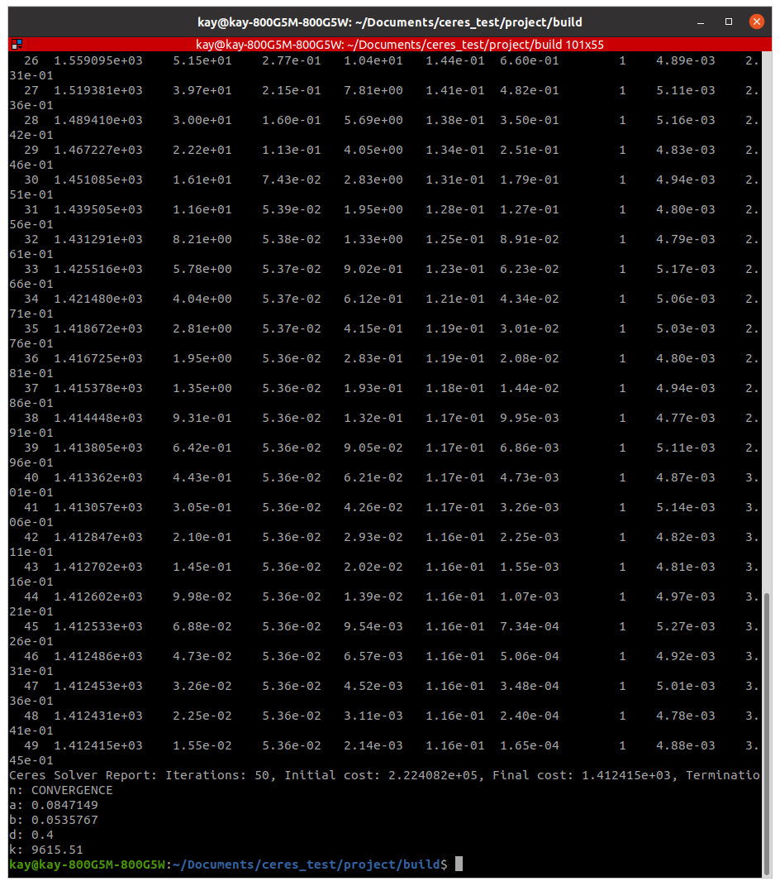

# Param_optimization_code
Spring stiffness, parameter optimization

`cd project`

Make the build directory.

`mkdir build`

Navigate to build directory

`cd build`

`cmake ..`

`make`

`./opt_param`

Result

